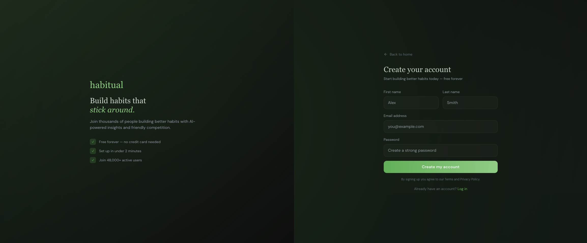
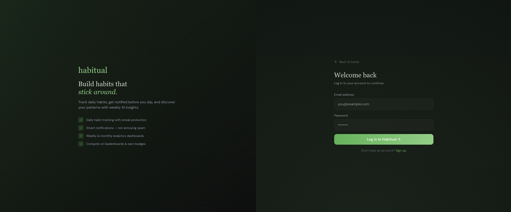
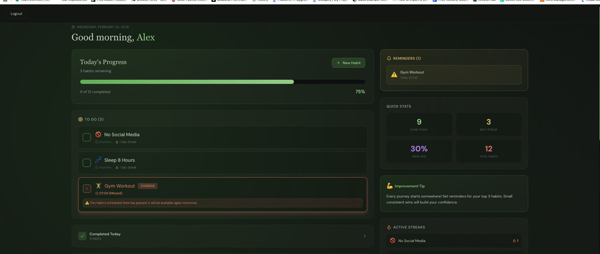
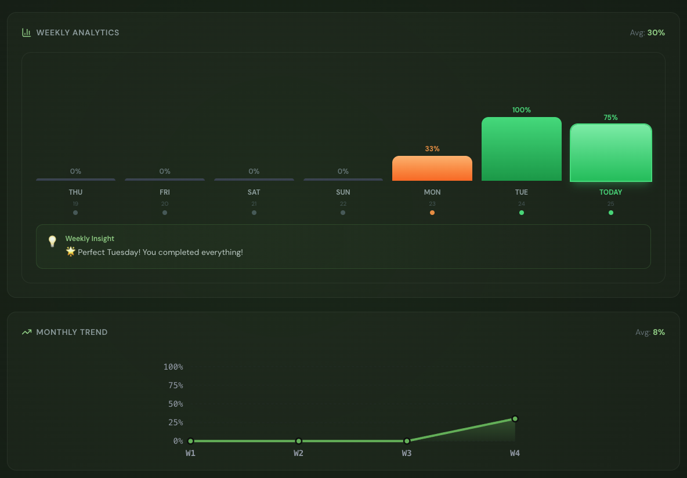
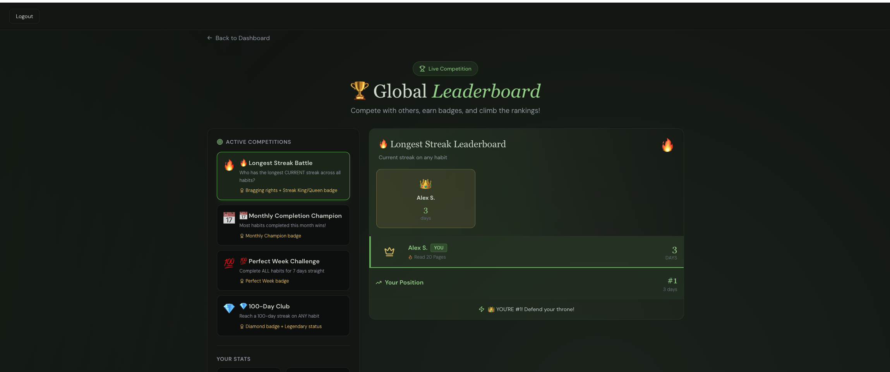

# Habitual - Build Better Habits

> Build better habits, track your progress, compete with others, and level up your daily routine.

[](https://reactjs.org/)
[](https://fastapi.tiangolo.com/)
[](https://www.postgresql.org/)
[](https://tailwindcss.com/)

---

## ✨ Features

### 🎯 **Smart Habit Tracking**
- ✅ One-tap habit completion
- 🔥 Real-time streak tracking
- ⏰ Smart reminder system
- 🚫 Auto-lock overdue habits

### 📊 **Advanced Analytics**
- 📈 Weekly & monthly charts
- 🎨 Color-coded completion bars
- 💡 AI-powered insights (Coming Soon)
- 📉 Trend analysis

### 🏆 **Global Competitions**
- 🥇 Live leaderboards
- 🏅 Achievement badges
- 👥 Squad mode (coming soon)
- 💎 XP & level system

### 🎨 **Beautiful UI**
- 🌙 Dark mode optimized
- 📱 Fully responsive
- ⚡ Smooth animations
- 🍃 Minimalist design

---

## 🖼️ Screenshots

### Landing Page

*Beautiful, interactive landing page*

### Signup Page



### Login Page



### Dashboard

*Track your daily habits with real-time progress updates*

### Weekly Analytics

*Visualize your performance with color-coded charts*


### Leaderboard

*Compete globally and earn badges*


---

## Tech Stack

### **Frontend**
- **React 18** - UI framework
- **React Router** - Navigation
- **Tailwind CSS** - Styling
- **Lucide React** - Icons
- **Axios** - HTTP client

### **Backend**
- **FastAPI** - Modern Python API framework
- **PostgreSQL** - Database
- **SQLAlchemy** - ORM
- **JWT** - Authentication
- **Bcrypt** - Password hashing

### **Features**
- RESTful API architecture
- JWT-based authentication
- Real-time progress tracking
- Analytics & insights engine
- Competition & leaderboard system

---

## Installation

### Prerequisites
- Node.js 18+ and npm
- Python 3.9+
- PostgreSQL 14+

### 1. Clone the repository
```bash
git clone https://github.com/aditi2605/habitual.git
cd habitual
```

### 2. Backend Setup
```bash
cd backend

# Create virtual environment
python -m venv venv
source venv/bin/activate  # On Windows: venv\Scripts\activate

# Install dependencies
pip install -r requirements.txt


# Run migrations (if using Alembic)
alembic upgrade head

# Start the server
uvicorn main:app --reload --port 8000
```

### 3. Frontend Setup
```bash
cd frontend

# Install dependencies
npm install

# Start development server
npm start
```